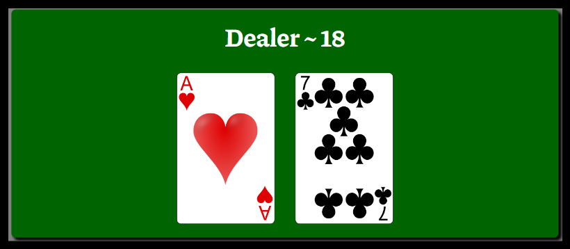
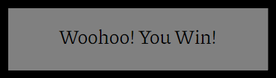
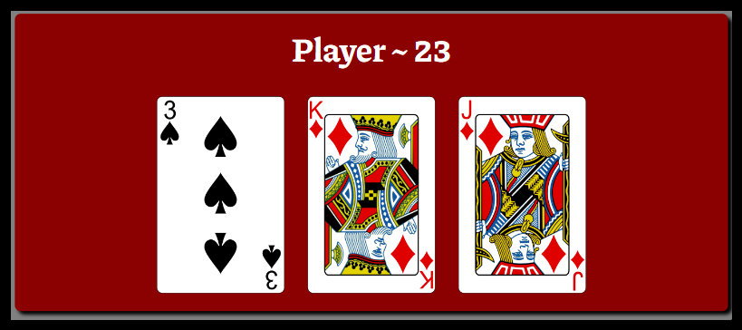
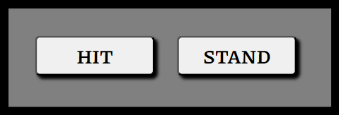

# Blackjack

    

This website was created to offer the user a fun and risk free way of playing the game blackjack.

## Table of contents
<ol>
    <li>UX</li>
    <li>Features</li>
    <li>Technologies Used</li>
    <li>Testing</li>
    <li>Deployment</li>
    <li>Credits</li>
<ol>

## UX
### Goals

The target audience for my blackjack website are:
- People who are interested in playing blackjack for fun.
- People that enjoy playing mobile games.
- People that wish to learn how to play blackjack.

User goals are:
- To be entertained by a quick and simple blackjack game.
- To learn the basic rules of playing blackjack.

The website will achieve this by:
- Offering a simple blackjack game that the user can play without any risk involved.

### Visual Design

#### Wireframes

Balsamiq was used to design the wireframes for the planning of this website.

    

    

#### Fonts

For this website the font Piazzolla was used for its angular look and feel. The font was imported from Google Fonts.

    

#### Colors

The colors used in this website are basic at first but as the user plays the game colors flash to indicate the winner and loser of each blackjack hand. If the player wins a hand the players div surrounding the cards will turn green, and it will turn red if the player loses the hand. The same is true for the dealer and if it's a tie both divs surrounding both sets of cards turn blue.

    

    

    

#### Styling

This blackjack game website was mainly designed and styled to be a mobile game although it can still be played on larger screen sizes. The styling used lets the user focus on the cards and the headings with the scores updating for each card drawn. The hit and stand buttons stand out also so the user knows immediately what their options are.

## Features

The heading is designed to be the title of the game and also the feature for generating a new hand.

    

For the dealers section the features include one face down card and one face up card, when the player stands the dealers face down card flips over and reveals the dealers total score as it is hidden until the players turn ends. This area is a feature that changes color depending on what the outcome of the game is and this color change tells the user whether they won or lost.

    

There's a popup feature that prints a message just below the heading commenting on if the player won or lost the game.

    

The players card section is similar to the dealers card section in that the dealt and drawn cards appear here. However the player does not have a face down card, all cards dealt to the player are face up. Also the players score feature is always visible to the player and updates with every card drawn.

    

When the player presses the hit button another card is drawn to the players hand and the players score is updated accordingly. The stand button ends the players turn and passes to the dealer where the hidden card is revealed, cards are drawn until the dealers score reaches 17 or higher. Then the scores are compared and the winner is determined.

    

## Technologies used

- HTML - HyperText Markup Language was the language used to create the structure of the website and all the elements which contain all the features of this blackjack game.

