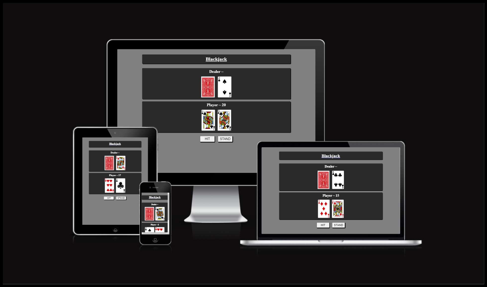
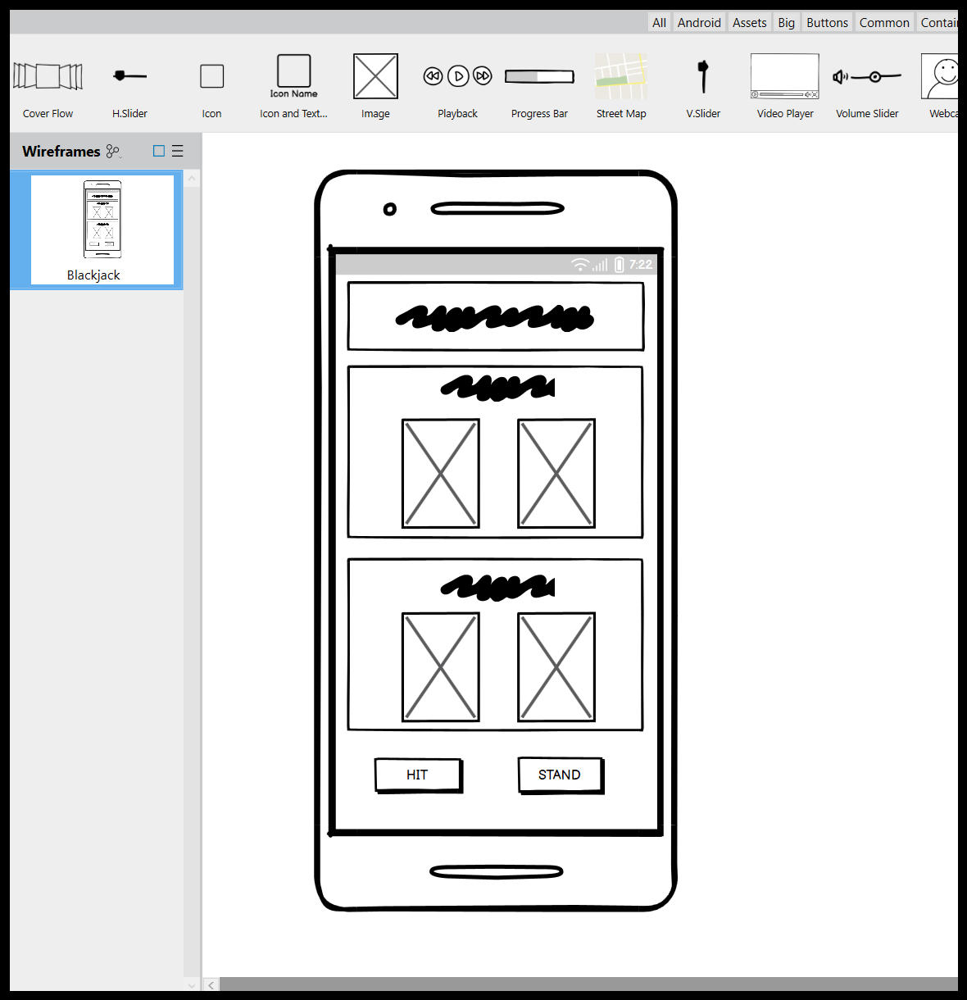
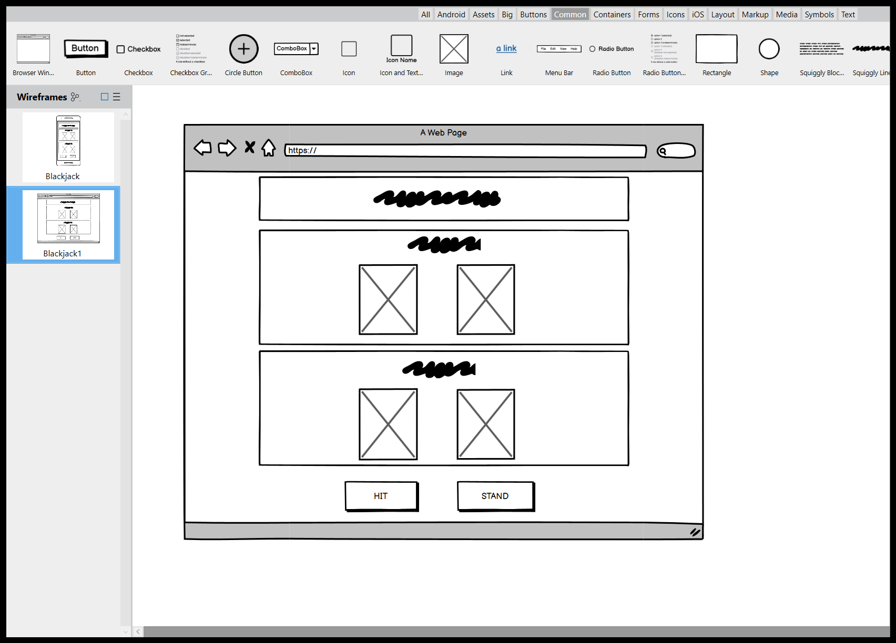
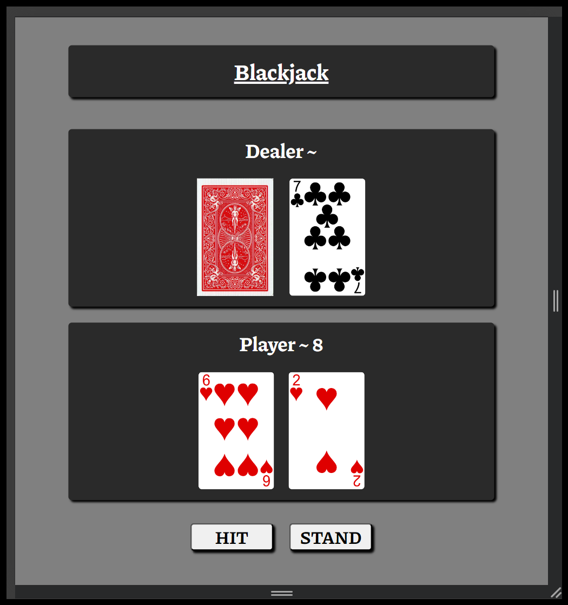
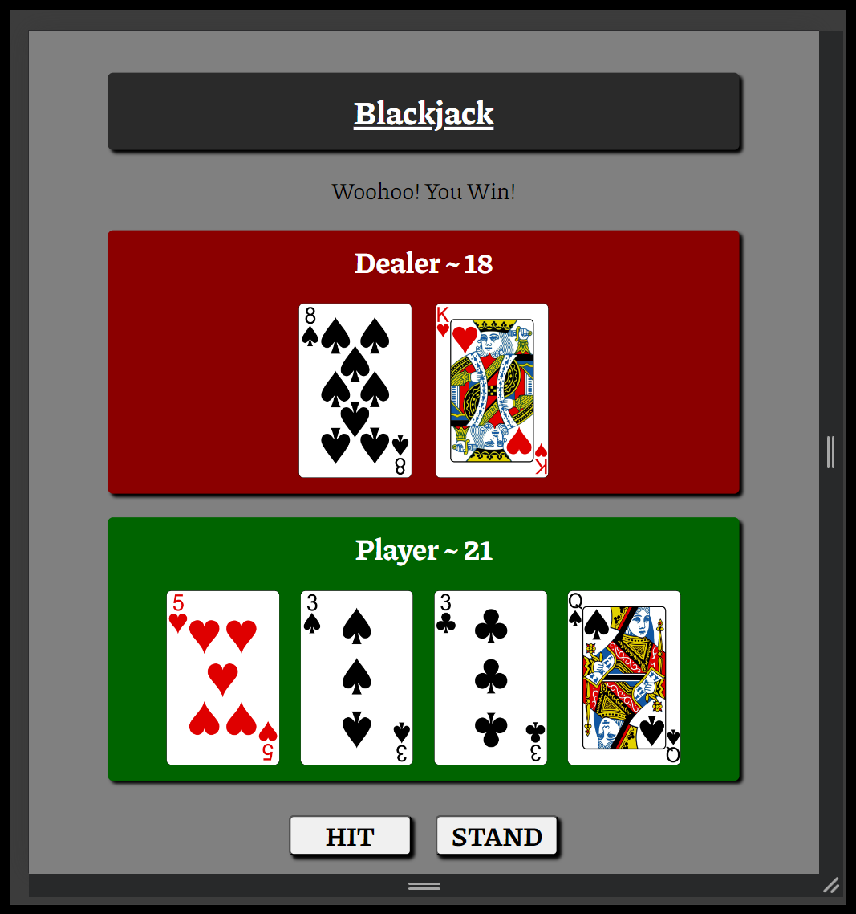
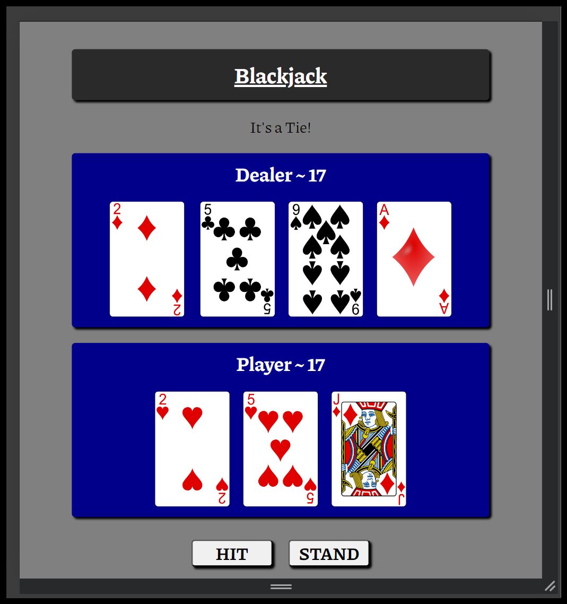

# Blackjack

    

This website was created to offer the user a fun and risk free way of playing the game blackjack.

## Table of contents
<ol>
    <li>UX</li>
    <li>Features</li>
    <li>Technologies Used</li>
    <li>Testing</li>
    <li>Deployment</li>
    <li>Credits</li>
<ol>

### 1. UX
#### Goals

The target audience for my blackjack website are:
- People who are interested in playing blackjack for fun.
- People that enjoy playing mobile games.
- People that wish to learn how to play blackjack.

User goals are:
- To be entertained by a quick and simple blackjack game.
- To learn the basic rules of playing blackjack.

The website will achieve this by:
- Offering a simple blackjack game that the user can play without any risk involved.

### Visual Design
#### Wireframes

Balsamiq was used to design the wireframes for the planning of this website.

    

    

#### Fonts

For this website the font Piazzolla was used for its angular look and feel. The font was imported from Google Fonts.

    

#### Colors

The colors used in this website indicate the winner and loser of each blackjack hand. If the player wins a hand the players div surrounding the cards will turn green, and it will turn red if the player loses the hand. The same is true for the dealer.

    

    

    

