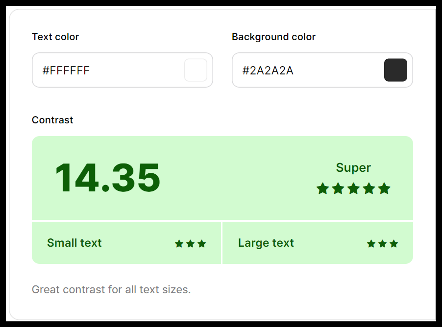
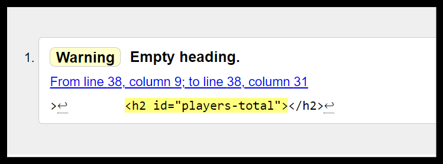
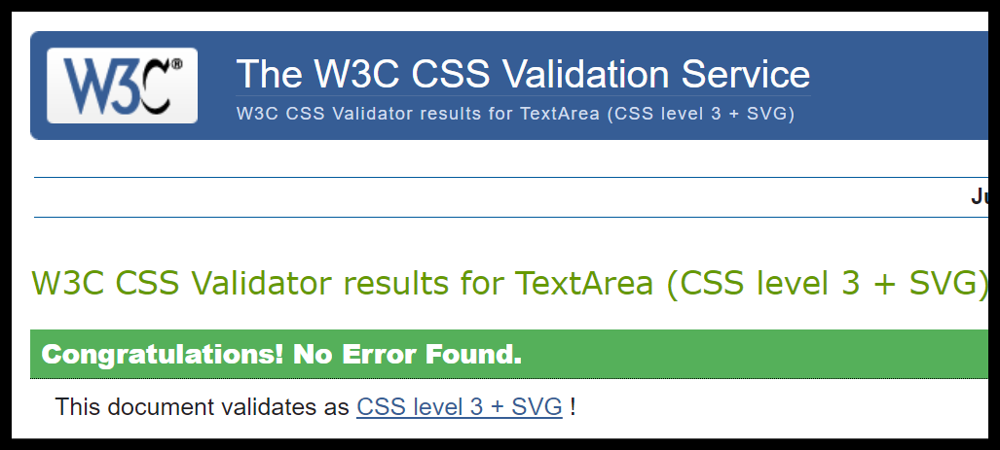
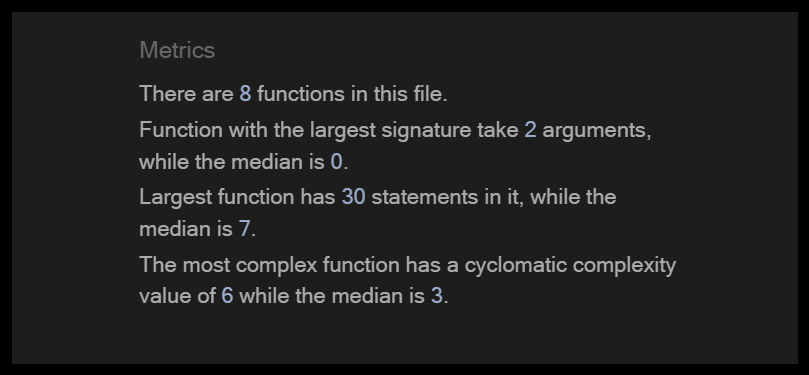

# Blackjack

    

This website was created to offer the user a fun and risk free way of playing the game blackjack.

## Table of contents
<ol>
    <li>UX</li>
    <li>Features</li>
    <li>Technologies Used</li>
    <li>Testing</li>
    <li>Deployment</li>
    <li>Credits</li>
<ol>

## UX
### Goals

The target audience for my blackjack website are:
- People who are interested in playing blackjack for fun.
- People that enjoy playing mobile games.
- People that wish to learn how to play blackjack.

User goals are:
- To be entertained by a quick and simple blackjack game.
- To learn the basic rules of playing blackjack.

The website will achieve this by:
- Offering a simple blackjack game that the user can play without any risk involved.

### Visual Design

#### Wireframes

Balsamiq was used to design the wireframes for the planning of this website.

    

    

#### Fonts

For this website the font Piazzolla was used for its angular look and feel. The font was imported from Google Fonts.

    

#### Colors

The colors used in this website are basic at first but as the user plays the game colors flash to indicate the winner and loser of each blackjack hand. If the player wins a hand the players div surrounding the cards will turn green, and it will turn red if the player loses the hand. The same is true for the dealer and if it's a tie both divs surrounding both sets of cards turn blue. The colors were tested for contrast with Coolors and showed no issues.

    

    

    

    

#### Styling

This blackjack game website was mainly designed and styled to be a mobile game although it can still be played on larger screen sizes. The styling used lets the user focus on the cards and the headings with the scores updating for each card drawn. The hit and stand buttons stand out also so the user knows immediately what their options are.

## Features

The heading is designed to be the title of the game and also the feature for generating a new hand.

    

For the dealers section the features include one face down card and one face up card, when the player stands the dealers face down card flips over and reveals the dealers total score as it is hidden until the players turn ends. This area is a feature that changes color depending on what the outcome of the game is and this color change tells the user whether they won or lost.

    

There's a popup feature that prints a message just below the heading commenting on if the player won or lost the game.

    

The players card section is similar to the dealers card section in that the dealt and drawn cards appear here. However the player does not have a face down card, all cards dealt to the player are face up. Also the players score feature is always visible to the player and updates with every card drawn.

    

When the player presses the hit button another card is drawn to the players hand and the players score is updated accordingly. The stand button ends the players turn and passes to the dealer where the hidden card is revealed, cards are drawn until the dealers score reaches 17 or higher. Then the scores are compared and the winner is determined.

    

## Technologies used

- HTML - HyperText Markup Language was the language used to create the structure of the website and all the elements which contain all the features of this blackjack game.

- CSS - Cascading Style Sheets was used to apply the styling of the website.

- Javascript - This is a dynamic programming language that's used for web development, in web applications, for game development, and lots more. It allows you to implement dynamic features on web pages that cannot be done with only HTML and CSS. For this website this is the language I mostly focused on. Javascript was used to create event listeners to implement functions when the player presses a button in the game, it was used to create the features in the game and also to do the logic of the game.

## Testing

- HTML has been validated by W3C Markup Validation Service.
When testing the html code through the w3c markup validation service, it gave a warning saying there was an empty heading. This was investigated and deemed to be fine as javascript was used to populate the heading.

    

- CSS was validated using the W3C validation service and showed no errors found.

    

- Javascript was validated with JSHint and returned no errors in the code.

    

This website was tested extensively on mobiles, laptops and desktops, also across different browsers such as Chrome, Firefox and Edge. I shared the URL with family who use Apple Iphones and no problems were noted. The game was tested extensively to make sure there were no bugs existing and the code ran through. All the features were tested on the live site.

## Deployment

- The website was deployed on Github pages were I set the root to Main and saved these settings. 

## Credits

- My mentors for advising me on all aspects from code to deployment.
- Various tutorials on Youtube.
- The Code Institute Love Maths walkthrough project.
- Github for version control.
- ChatGPT for dissecting functions to gain better knowledge of Javascript.
